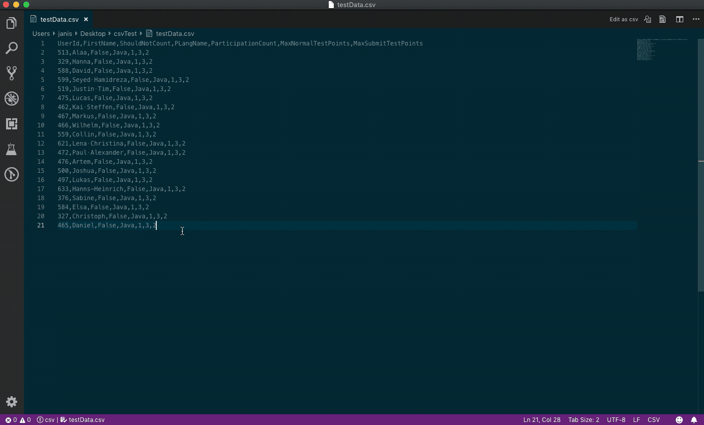

# vscode-edit-csv README

This extensions allows you to edit csv files with an excel like table ui

## Features

Execute the command `edit as csv` to open an editor for the current file.

*Execute the command again to switch back to the source file or to switch back to the editor*



**Note that the data flow is one way (editor to source file). If you make changes to the source file (.csv) while the editor is open, the editor will not be updated!**

## Important Notes

- On initial load all rows are expanded so that all rows have equal length (number of cells)

- Plugin Version **0.0.11** had an issue with loading and saving files with more than \~1 MB
	- saved files were corrupted (content of the first \~1MB was repeated after the first \~1MB until the file size was reached)

## How this extension works

When you click on `edit csv file`

- the file content is cut into pieced and transferred via `[webview].postMessage`
- the current config is stringified and injected into the editor (webview) html
- a manager stores a reference to the webview, source file uri, editor uri

- in the webview the pieces are put together and the text is parsed as csv and displayed in the (handson) table element

When you click on `apply`

- the current table is transformed into csv, transferred via `vscode.postMessage` to the extension and written to the source file
	- if you clicked on `apply` by accident, you can undo the changes in the table element (with the usual shortcuts) and apply again or open the source file and just do an undo (with the usual shortcuts)

- When you click on `apply and save`
	- the first step is equal to `apply`
	- then the source file is saved


- When you click in `Read again`
	- the injected content is used (when the editor was opened), this does not read the source file again

As you can see this **does not** scale very well with **large csv files** (needs to be stringified and stored the whole time)

## Extension Settings

There are some settings for this plugin. Open the VS Code Settings and search for `csv-edit`

## Known Issues

- if the source file content changes while the editor is open, the editor will not be updated (e.g. take new content)
	- if you then apply the editor the source file content/changes are **overwritten!**

- `apply and save` an unnamed file will close the editor
	- this is because the new uri for the new file is not known and for some reason if an extension saves an unnamed file the new file is not displayed automatically
		- maybe this can be resolved when https://github.com/Microsoft/vscode/issues/43768 is closed

- renaming a file while an editor is open for that file will break the reference the the source file
	- thus changes can no longer be saved/applied
	- maybe this can be resolved when https://github.com/Microsoft/vscode/issues/43768 is closed

- there are probably *some* issues which enabling `hasHeader`, (and removing first row) and undoing/redoing that
	- there are some issues with switching `hasHeader` option in combination with hiding comment rows and and undo/redo

## Alternatives

*If you want to preview csv files you can go for the extension [Excel Viewer](https://marketplace.visualstudio.com/items?itemName=GrapeCity.gc-excelviewer). It has some more advanced sorting and filtering features.*

## How long will it stay in preview?

There are two things missing...

- a pretty icon ;)
- tests
	- especially for interaction between vs code and the webview
	- I added some listeners to handsontable hooks which manipulate data and rendering...


## Why not...?

- use merged cells for comments (rows)
	- there are some problems with adding/removing rows in connection with undo & redo
- update handsontable to 7.x.x
	- with version 7 handsontable is only free for non-commercial use

## Used projects

- for csv parsing/writing: [papaparse](https://github.com/mholt/PapaParse)
- for grid/table element: [handsontable](https://github.com/handsontable/handsontable)
- for ui: [bulma](https://github.com/jgthms/bulma), [bulma-extension](https://github.com/Wikiki/bulma-extensions), [fontawesome](https://github.com/FortAwesome/Font-Awesome)


## How to build locally

To compile (and watch) the files in `csvEditorHtml` run

```bash
cd csvEditorHtml
tsc -w #or just tsc to transpile only once
```

then press `F5` to run the extension

When you edit `csvEditorHtml/index.html` you need to manually copy the changes (everything in the body but without the scripts) into `src/getHtml.ts` (past into body)

You can also open `csvEditorHtml/index.html` in your favorite browser and play around *(the vs code settings are not applied in the browser)*